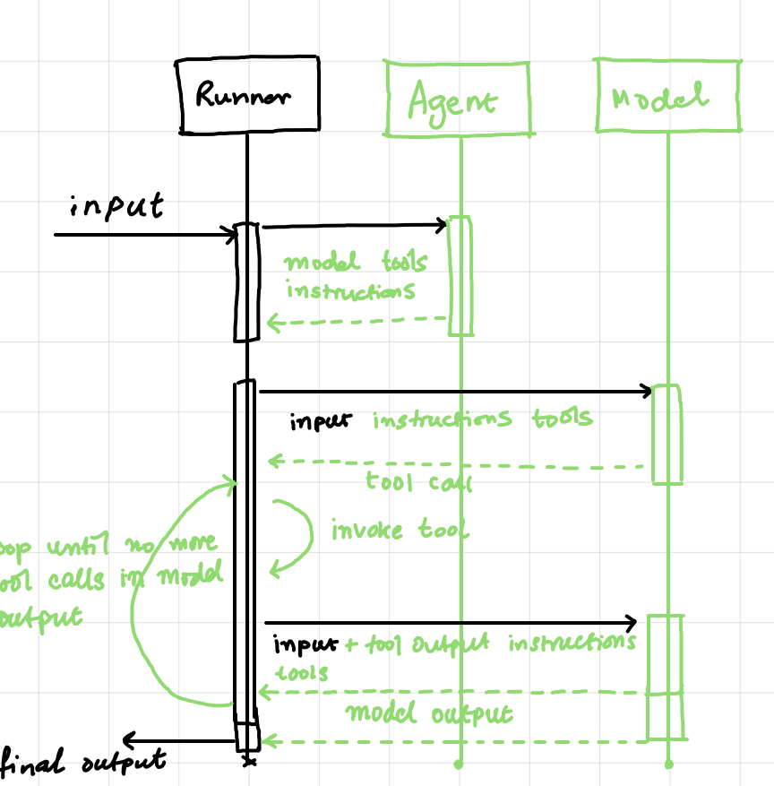
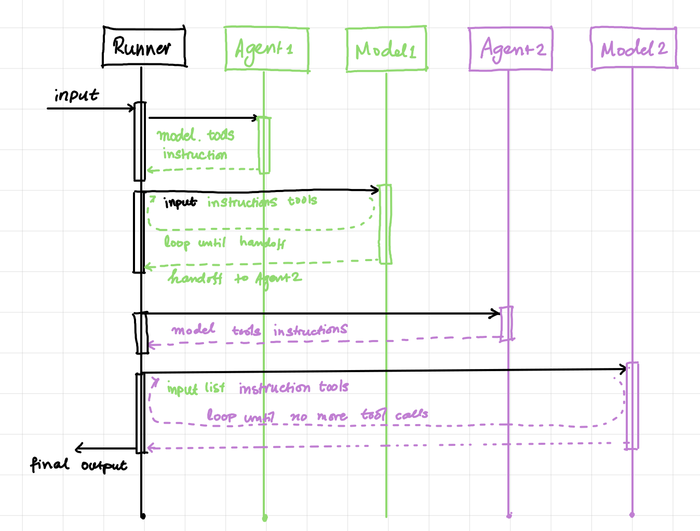
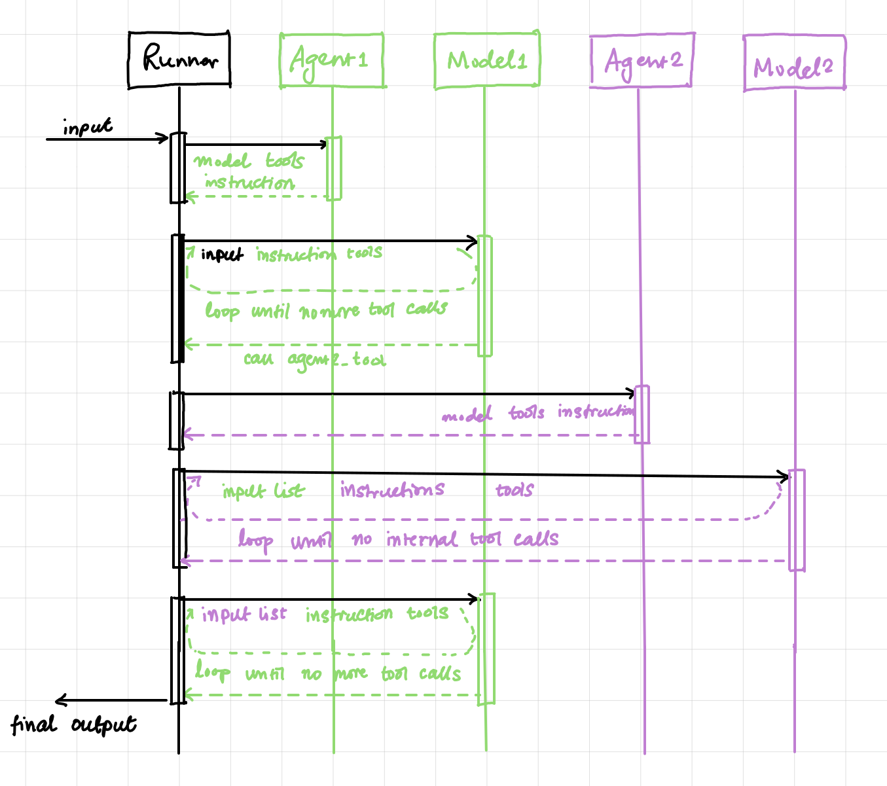

# Running Notes OpenAI Agents

**Code Flow**

```
run() 
  -> _run_single_turn() 
  -> _get_new_response() 
  -> model.get_response() 
  -> OpenAIResponsesModel::get_response() 
  	-> _fetch_response() 
  	-> client.responses.create()
```

I'll see a bunch of `span` creation and management in the source code, this is mostly to enable tracing. For understanding how the actual flow works, I can ignore it.

### Run Loop

Here is what happens when I call [`Runner.run()`](https://openai.github.io/openai-agents-python/ref/run/#agents.run.Runner.run) -

The runner then runs a loop:

1. We call the LLM for the current agent, with the current input.
2. The LLM produces its output.
   1. If the LLM returns a `final_output`, the loop ends and we return the result.
   2. If the LLM does a handoff, we update the current agent and input, and re-run the loop.
   3. If the LLM produces tool calls, we run those tool calls, append the results, and re-run the loop.
3. If we exceed the `max_turns` passed, we raise a [`MaxTurnsExceeded`](https://openai.github.io/openai-agents-python/ref/exceptions/#agents.exceptions.MaxTurnsExceeded) exception.

>   **Note**
>
>   The rule for whether the LLM output is considered as a "final output" is that it produces text output with the desired type, and there are no tool calls.

## Agent

The `Agent` class is a container for a bunch of different configs and other objects that the Responses API uses to call the LLM. The main work is done in the `Runner.run()` function. At a minimum I need to provide the agent with its instructions (aks the "system" prompt), the model to use (and optionally a model config), and the tools it will use to do its job.

While the instructions are usually hardcoded into the agent, I can also provide a function that will dynamically generate instructions at runtime. This function takes the context (see below) and the owning agent as input parameters and returns a string.

Listing out the properties of an Agent so that I can get a sense of its functionality -

* `name`
* `instructions`: The system prompt to pass on to the model. This can be a string or a function that returns a string.
* `handoff_description`: If this is a handoff agent, then this will describe what kind of handoffs it does. For the most part this is generated automatically from the agent's main description when I do this - `Agent(name="Main Agent", handoffs=[this_agent_obj])`.
* `handoffs`: A list of agents or `Handoff` objects that this agent will hand off to.
* `model`: The name of the model or an instance of the `Model` that should be used by the Runner when running this agent.
* `model_settings`: An object of type `ModelSettings`. There are a bunch of settings for a model so this is described below separately.
* `tools`: A list of tools that the agent can use.
* `mcp_servers`: A list of `MCPServer`s that the agent can use. Every time the agent runs, it will include tools from these servers in the list of available tools. So the tools can be change from one run to another depending on whether the server got updated in the interim.
* `mcp_config`: An object of type `MCPConfig`. The only property it has is `convert_schemas_to_strict`.
* `input_guardrails`: A list of `InputGuardrail` objects that will be run in parallel with this agent if it is the starting agent.
* `output_guardrails`: A list of `OutputGuardrail` objects that will be run in parallel with this asgent if it is the ending agent.
* `output_type`: In most cases the "final output" of running an agent is a string. If I want it to give a structured output, I can pass a Pydantic BaseModel here.
* `hooks`: An object of type `AgentHooks` which is just a container for a bunch of event handlers that will be called by the runner if they are provided.
* `tool_use_behavior`: The default behavior where the Runner keeps calling the LLM until the model's response does not contain a tool call is called `"run_llm_again"`. I can change it to `"stop_on_first_tool"` if I don't want the output of the first tool call to go back to LLM, but rather have that be the final output. Instead of stopping on the first tool, I can even provide a list of tool names which when invoked should stop the Runner's loop.  Such final tools need to return `ToolToFinalOutputResult` objects as return types.
* `clone`: Makes a copy of the Agent with some properties changed.
* `as_tool`: Transform this agent to a tool that can be called by other agents.
* A bunch of getters - `get_system_prompt`, `get_mcp_tools`, `get_all_tools`

Model settings:

* `temperature`

* `top_p`

* `frequency_penalty`

* `presence_penalty`

* `tool_choice`

* `paralel_tool_calls`

* `truncation`

* `max_tokens`

* `reasoning`

* `metadata`

* `store`

* `include_usage`

* A bunch of extras - `extra_query`, `extra_body`, `extra_headers`, `resolve`

### Agent Patterns

#### Stand Alone Agents



The Runner gets all the info from the Agent - at the minimum its instruction (system prompt), tools, and the model it wants to use. Then the Runner calls the model with the user prompt it has received along with the agent's instruction and tools. It runs in a loop mentioned below until the model's response does not have any tool calls in it. This is then considered the `final_output` that is passed back to the user.

#### Handoff Agents



Handoff agents show up as additional tools in the starting agent's tool collection. For example in `homework.py` the triage agent is defined as such -

```python
math_tutor = Agent(name="Math Tutor", ...)

history_tutor = Agent(name="History Tutor", ...)

triager = Agent(
	name="Triage Agent",
	handoffs=[history_tutor, math_tutor],
	...
)
```

This will show up the trage agent's tools as -

```python
Tools:
[
  {
    "name": "transfer_to_history_tutor",
    "parameters": {
      "additionalProperties": false,
      "type": "object",
      "properties": {},
      "required": []
    },
    "strict": true,
    "type": "function",
    "description": "Handoff to the History Tutor agent to handle the request. <history tutor's description>"
  },
  {
    "name": "transfer_to_math_tutor",
    "parameters": {
      "additionalProperties": false,
      "type": "object",
      "properties": {},
      "required": []
    },
    "strict": true,
    "type": "function",
    "description": "Handoff to the Math Tutor agent to handle the request. <math tutor's description>"
  }
]
```

Once the starting agent's model responds with a tool call to the handoff tool, the starting agent's job is done. The Runner gets the required info from the handoff agent (its instruction, tools, and models) and passes the entire conversation history up until now to the handoff agent's model and starts running the loop again.

#### Tool Agents



These also show up as function tools in the starting agent. Once the model responds with a calling the agent tool, the Runner gets the info from the tool agent, but instead of calling the tool agent's model with the full conversation history, it only provides the input generated by the starting agent's model for the "function" call. And once the generated agent's model responds with a "final output", i.e., no more tool calls, then the "control" goes back to the starting agent's model which is provided the output as part of the conversation history just like any other function tool call output.

#### Deterministic Workflow

The basic idea is to define a bunch of agents, some with structured outputs, and the call the agents one-by-one. Use their structured output to determine the next step of the workflow. So the code will look something like this -

```python
class TaskOneOutput(BaseModel):
  is_good: bool
  ...
  
task_one_agent = Agent(name="Task One", output_type=TaskOneOutput, ...)
task_two_agent = Agent(name="Task Two", ...)

task_one_resp = await Runner.run(task_one_agent, user_prompt)
task_one_out = cast(TaskOneOutput, task_one_resp.final_output)
if task_one_out.is_good:
  user_prompt += "some more info here..."
  task_two_resp = await Runner.run(task_two_agent, user_prompt)
  print(task_two_resp.final_output)
```

For simple enough workflows, I can just make an orchestrator agent and with good enough instructions it will execute the workflow without my having to hardcode anything. See `workflow.py` for an example like that.

#### Actor-Critic

I can have the main agent be the actor and define another critic agent that will take in the output generated by the actor agent to assess its quality (or any other attribute). I think of this as a subset of the Deterministic Workflow pattern. The critic agent needs to have structured output that is possible to be used in deterministic code. The examples have a story outline actor agent and a story outline judge critic agent.

```python
actor = Agent(
  name="story_outline_generator",
  instructions=(
    "You generate a very short story outline based on the user's input."
    "If there is any feedback provided, use it to improve the outline."
  ),
)

class CriticalFeedback(BaseModel):
	feedback: str
	score: Literal["pass", "needs_improvement", "fail"]

critic = Agent[None](
  name="evaluator",
  instructions=(
    "You evaluate a story outline and decide if it's good enough."
    "If it's not good enough, you provide feedback on what needs to be improved."
    "Never give it a pass on the first try."
  ),
  output_type=EvaluationFeedback,
)

actor_result = await Runner.run(actor, input_items)
input_items = story_outline_result.to_input_list()
critic_result = await Runner.run(critic, input_items)
result: CriticalFeedback = critical_result.final_output
print(f"Evaluator score: {result.score}")
```

#### With Guardrails

Look at `homework.py` for example of input guardrail. Output guardrails are not that different.

#### Parellelization

Call a bunch of agents at once and then choose the best answer. Unless there is a way to objectively measure the answer quality, I can have a critic agent choose the best answer.

```python
agent1 = Agent(...)
agent2 = Agent(...)
agent3 = Agent(...)
critic = Agent(...)

res1, res2, res3 = await asyncio.gather(
	Runner.run(agent1, prompt),
  Runner.run(agent2, prompt),
  Runner.run(agent3, prompt)
)

outputs = "\n\n".join([
  ItemHelpers.text_message_outputs(res1.new_items),
  ItemHelpers.text_message_outputs(res2.new_items),
  ItemHelpers.text_message_outputs(res3.new_items),
])
final_output = await Runner.run(critic, outputs)
```

#### Routing

Have an agent that is the first to receive the user input prompt and then depending on the content of the input, hands off to one of the several handoff agents. This is shown in `homework.py`.

### Lifecycle Hooks

Agents SDK has provides a bunch of callbacks aka hooks aka event handlers for different lifecycle events for both the Runner and the Agent. See [lifecycle documentation](https://openai.github.io/openai-agents-python/ref/lifecycle/) for more details. But here is a quick list of the different events -

* Runner Hooks
  * `on_agent_start`
  * `on_agent_end`
  * `on_handoff`
  * `on_tool_start`
  * `on_tool_end`
* Agent Hooks
  * `on_start`
  * `on_end`
  * `on_handoff`
  * `on_tool_start`
  * `on_tool_end`

### Result

In the homework example the final output of the agent is simple text of type `output_text`. I can customize this by providing a structured type as the `output_type` argument to the `Agent`'s constructor.

```python
class CalendarEvent(BaseModel):
  ...

agent = Agent(
	name="Calendar Extractor",
  instructions="Extract calendar events from text.",
  output_type=CalendarEvent
)
```

Now the `final_output` will have an object of type `CalendarEvent`.

The [`result`](https://openai.github.io/openai-agents-python/ref/result/#agents.result.RunResult) object returned by the runner has a bunch of other useful properties that I can explore at some later date -

* `to_input_list()` should give me the same info that I am trawling the debug logs for.
* `new_items` contains the new `RunItem`s generated by the LLM, these can be message outputs, handoff calls, handoff items, tool calls, etc.
* Guardrail results.

### Builtin Tools

Just like the regular Responses/Chat API, there are three built-in tools that I can use - 

* The [`WebSearchTool`](https://openai.github.io/openai-agents-python/ref/tool/#agents.tool.WebSearchTool) lets an agent search the web.
* The [`FileSearchTool`](https://openai.github.io/openai-agents-python/ref/tool/#agents.tool.FileSearchTool) allows retrieving information from your OpenAI Vector Stores.
* The [`ComputerTool`](https://openai.github.io/openai-agents-python/ref/tool/#agents.tool.ComputerTool) allows automating computer use tasks.

### Function Tools

For a demo look at `function_tools.py`  and `function_tools_ctx.py`. 

Defining a function tool is a lot more straightforward than it was in either the Responses API or the Chat API. I just need to add a decorator called `@function_tool` on top of the function. As long as the function is well documented and has human understandable names, the Agents SDK will create the function tool definition to pass to the Responses API. E.g., for a function like so -

```python
@function_tool
def get_weather(latitude: float, longitude: float) -> int:
    """
    Get the current temperature for provided coordinates in celsius.

    Args:
        latitude: Latitude of the location.
        longitude: Longitude of the location.

    Returns:
        The temperature of the given location. The temperature is in Celsius units.
    """
    response = requests.get(
        f"https://api.open-meteo.com/v1/forecast?latitude={latitude}&longitude={longitude}&current=temperature_2m,wind_speed_10m&hourly=temperature_2m,relative_humidity_2m,wind_speed_10m"
    )
    data = response.json()
    return data["current"]["temperature_2m"]
```

This is the function tool definition that will be generated -

```python
{
    "name": "get_weather",
    "parameters": {
      "properties": {
        "latitude": {
          "description": "Latitude of the location.",
          "title": "Latitude",
          "type": "number"
        },
        "longitude": {
          "description": "Longitude of the location.",
          "title": "Longitude",
          "type": "number"
        }
      },
      "required": [
        "latitude",
        "longitude"
      ],
      "title": "get_weather_args",
      "type": "object",
      "additionalProperties": false
    },
    "strict": true,
    "type": "function",
    "description": "Get the current temperature for provided coordinates in celsius."
  }
```

According to the documentation, the Agents SDK will use `inspect` and `griffe` to generate a pydantic `BaseModel` of the function. The code for this is in `src/agents/function_schema.py`. There are a number of ways I can further customize this behavior. See `src/agents/tool.py::function_tool` to see how.

> ⚠️ The docstrings for the arguments are **not** completely captured, only the first line is captured.

While I have not tried it, it should also "just works" for input types that are `BaseModel`s. Even if the function tool has a structured output in the form of a `BaseModel`, it will be eventually returned as a stringified JSON. I don't have to worry about doing any of the conversion though.

By default if the function crashes, Agents SDK will run a `default_tool_error_function` but I can pass in my own error function to the `function_tool` decorator.

I can also have function tools that accept context. The context does not show up in the function definition passed to the LLM though. E.g., for a context function -

```python
@function_tool
def notify(ctx: RunContextWrapper[User], title: str, message: str) -> NotifyStatus:
    """Notify a user via email or text

    If the user provided in the context has an email address, then they are notified via email.
    Otherwise, their phone number is used to notify them via text.

    Args:
        title: The title of the notification. In an email, this will be the subject. In a text
        message, this will just be the first line.
        message: The full message of the notification. In an email, this will be the body. In a text
        message, this will just be the rest of the message.

    Retunrs:
        The notification status. If the notification was sent successfully it will be
        {code: 200, status: "OK"}. Upon failure the return will have a different code and status.
    """
    user: User = ctx.context
    if user.email:
        print(f"Sending email to {user.email} with subject: {title}")
        return NotifyStatus(code=200, status="OK")
    elif user.phone:
        print(f"Sending text message to {user.phone} with title {title}")
        return NotifyStatus(code=200, status="OK")
    else:
        return NotifyStatus(code=400, status="NOT OK")

```

The generated function definition has no mention of `User` or `NotifyStatus`.

```python
{
    "name": "notify",
    "parameters": {
      "properties": {
        "title": {
          "description": "The title of the notification. In an email, this will be the subject. In a text",
          "title": "Title",
          "type": "string"
        },
        "message": {
          "description": "The full message of the notification. In an email, this will be the body. In a text",
          "title": "Message",
          "type": "string"
        }
      },
      "required": [
        "title",
        "message"
      ],
      "title": "notify_args",
      "type": "object",
      "additionalProperties": false
    },
    "strict": true,
    "type": "function",
    "description": "Notify a user via email or text\n\nIf the user provided in the context has an email address, then they are notified via email.\nOtherwise, their phone number is used to notify them via text."
  }
```

### Context

I can define an agent with a context which is a sturctured type and when I run the agent I can pass in an object of this type. This context object will then be passed around to all agent related function calls like its tools, lifecycle hooks, etc. It is best explained by an example -

```python
class User(BaseModel):
  name: str
  uid: int
  
@function_tool
async def load_user_details(ctx_wrapper: RunContextWrapper[UserInfo]) -> str:
  user: User = ctx_wrapper.context
  return json.dumps(db.query(user))

async def main():
  user = User(name="Cookie Monster", uid=1)
  agent = Agent[UserInfo](
  	name="Cookie Agent",
    tools=[load_user_details]
  )
  
  result = await Runner.run(
  	starting_agent=agent,
    input="...some input here...",
    context=user
  )
```

### Handoffs

In the above code I pass in the two agents directly in an array to the triage agent in line 21. This created the default handoff functions `transfer_to_history_tutor` and `transfer_to_math_tutor`. I can customize this behavior - I can pass in my own function definitions, function descriptions, and even a custom handoff event handler. This is done by calling the `handoff` function with the handoff agent and some other customization as input args. In addition to all this I can also customize the handoff s.t the LLM will give a structured output in its function call with some additional info filled in. E.g., in the vanilla handoff, the LLM does not give much info apart from simply calling the function -

```python
[
  {
    "arguments": "{}",
    "call_id": "call_VwXeuEG2viYUayUIfXiboUHg",
    "name": "transfer_to_history_tutor",
    "type": "function_call",
    "id": "fc_680437476da48191966a10f765b13f9f0ca3674611fc6a09",
    "status": "completed"
  }
]
```

But if I do this -

```python
class EscalationData(BaseModel):
  reason: str
  
 async def on_handoff(ctx: RunContextWrapper[None], input_data: EscalationData) -> None:
  ...
  
agent = Agent(name="Escalation Agent")

escalation_handoff = handoff(
	agent=agent,
  on_handoff=on_handoff,
  input_type=EscalationData
)
```

then the LLM will fill out the `EscalationData` in its function call.

There is also the concept of input filters, where I can pass in another function that will take the original handoff agent's input and can strip out (or even add in) more stuff and output another input type that will then actually get fed to the handoff Agent and its LLM call.

The documentation has some recommended prompts that I can pass as `instructions` to my handoff agent. I did not do this in the homework example, but if I want to, here is how to do it -

```python
from agents.extensions.handoff_prompt import RECOMMENDED_PROMPT_PREFIX

billing_agent = Agent(
	name="Billing Agent",
  instructions=f"""{RECOMMENDED_PROMPT_PREFIX}
  <rest of the prompt here>
  """
)
```

This is what the prompt looks like as of this writing (4/20/2025) -

```
# System context
You are part of a multi-agent system called the Agents SDK, designed to make agent coordination and execution easy. Agents uses two primary abstraction: **Agents** and **Handoffs**. An agent encompasses instructions and tools and can hand off a conversation to another agent when appropriate. Handoffs are achieved by calling a handoff function, generally named `transfer_to_<agent_name>`. Transfers between agents are handled seamlessly in the background; do not mention or draw attention to these transfers in your conversation with the user.
```

### MCP

According to the main MCP documentation, MCP provides three things - prompts, resources, and tools. So far I have distilled my understanding around tools and specifcally function tools. Just like I can define local functions and pass them in as tools, an MCP server defines a bunch of remote functions that can be used as tools. It has some discovery APIs to list the tools and its capabilities at runtime, and also provide the endpoint to all the remote function. In fact they even use JSON-RPC 2.0 as the message protocol.

The MCP server endpoint can be either in-proc (is probably a sub-process, so not strictly in-proc) or out-of-proc on an HTTP over SSE endpoint.

Using an MCP server is fairly straightforward, I just provide a list of MCP server objects that I want to use to the Agent's constructor.

## Documentation

* [x] Intro
* [x] Quickstart
* [x] Agents
* [x] Running Agents
* [x] Results
* [ ] Streaming
* [x] Tools
* [x] MCP
* [x] Handoffs
* [x] Tracing: Not much too it, when I do decide to use traces I should do it `with` context manager and spans are a related concept.
* [x] Context management
* [x] Guardrails
* [x] Orchestrating multiple agents
* [x] Agent visualization

## OpenAI Examples

### Basic

* [x] `agent_lifecycle_example.py`
* [x] `dynamic_system_prompt.py`
* [x] `hello_world_jupyter.py`
* [x] `hello_world.py`
* [x] `lifecycle_example.py`
* [x] `previous_response_id.py`
* [ ] `stream_items.py`
* [ ] `stream_text.py`
* [x] `tools.py`

### Agent Patterns

* [x] `agents_as_tools.py`
* [x] `deterministic.py`
* [x] `forcing_tool_use.py`
* [x] `input_guardrails.py`
* [x] `llm_as_a_judge.py`
* [x] `output_guardrails.py`
* [x] `parallelization.py`
* [x] `routing.py`
* [ ] `streaming_guardrails.py`

### Full Examples

* [x] `customer_service`
* [ ] `financial_research_agent`
* [ ] `handoffs`
* [ ] `mcp`
* [x] `research_bot`

