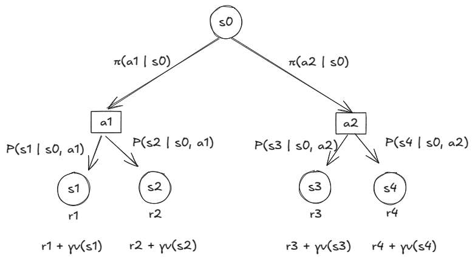
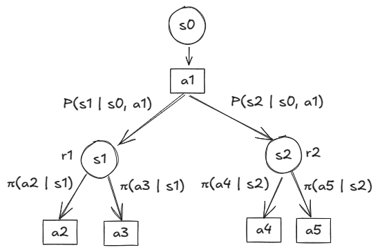
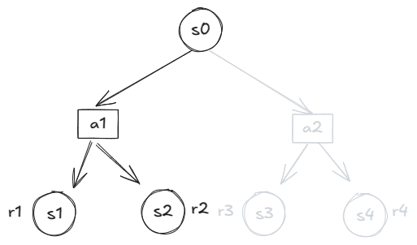
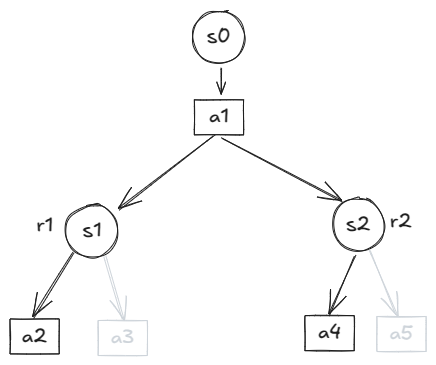

# Running Notes on RL

After looking at a bunch of different RL libs, I think I'll prefer [CleanRL](https://github.com/vwxyzjn/cleanrl), [Stable Baselines](https://github.com/DLR-RM/stable-baselines3), and [Spinning Up](https://spinningup.openai.com) in that order. For environments I'll install [Gymnasium](https://github.com/Farama-Foundation/Gymnasium) and [Mujoco](https://mujoco.org/). I like CleanRL because it promises single-page implementations. I will be able to learn about the implementation without getting too bogged down by the details. But it does not have all the algos that are covered in the book, so I'll use Stable Baselines for those. Stable Baselines also has a pretty simplified implementation. Finally, for the stuff that is still left uncovered, I'll use Spinning Up.

## Bellmann's Equations

### Summary

When following a specific stochastic policy $\pi$ -
$$
q(s, a) = \mathbb E_P \left[ r + \gamma v(s') \right] \\
v(s) = \mathbb E_{\pi} \left[ q(s, a) \right] \\
v(s) = \mathbb E_{P, \pi} \left[ r + \gamma v(s') \right] \\
q(s, a) = \mathbb E_{P, \pi} \left[ r + \gamma\;q(s', a') \right] \\
\pi(s) =
$$

When following a deterministic optimal policy -
$$
v_*(s) = \underset{a}{max}\;q_*(s, a) \\
v_*(s) = \underset{a}{max} \; \mathbb E_P \left[ r + \gamma\;v_*(s') \right] \\
q_*(s, a) = \mathbb E_P \left[ r + \gamma \; \underset{a'}{max} \; q_*(s', a') \right]
$$

The value of reaching state $s_1$ is the reward the agent gets from reaching $s_1$ plus the discounted value of the state, i.e., $r_1 + \gamma v(s_1)$. Similarly for $s_2$. And the value of taking action $a_1$ is the average of these values -
$$
q(s_0, a_1) = avg\left( \left( r_1 + \gamma v(s_1) \right) + \left( r_2 + \gamma v(s_2) \right) \right)
$$
After taking action $a_1$, the agent can land in $s_1$ with probability of $P(s_1 \vert s_0, a_1)$ and similarly for the $s_2$. So the average becomes -
$$
\begin{align}
q(s_0, a_1) &= P(s_1 \vert s_0, a_1) \left\{ r_1 + \gamma v(s_1) \right\} \\
&+ P(s_2 \vert s_0, a_1) \left\{ r_2 + \gamma v(s_2) \right\}
\end{align}
$$
Writing this in terms of expectation -
$$
q(s_0, a_1) = \mathbb E_{S' \sim P} \left[ R + \gamma v(S') \mid S = s_0, A = a_1 \right] \\
$$
Or more generally -
$$
\enclose{box}
{q(s, a) = \mathbb E_{S' \sim P} \left[ R + \gamma v(S') \mid S = s, A = a \right]} \tag{1}
$$

Here -

* $S$ is the random variable representing the current state.
* A is the random variable representing the action.
* $S'$ is the random variable representing the next state.
* $R$ is the random variable representing the reward upon taking action $A$ and landing on state $S'$.

Similarly the value of taking action $a_2$ is -
$$
q(s_0, a_2) = \mathbb E_{S' \sim P} \left[ R + \gamma v(S') \mid S=s_0, A=a_2 \right]
$$
And the total value of being in state $s_0$ is the simply the average of taking both actions.
$$
v(s_0) = avg(q(s_0, a_1) + q(s_0, a_2))
$$

The agent takes action $a_1$ with probabilty $\pi(a_1 \vert s_0)$ and $a_2$ with $\pi(a_2 \vert s_0)$ so the average is -
$$
v(s_0) = \pi(a_1 \vert s_0)\;q(s_0, a_1) + \pi(a_2 \vert s_0)\;q(s_0, a_2)
$$
Writing this in expectation form -
$$
v(s_0) = \mathbb E_{A \sim \pi} \left[ q(s_0, A) \right]
$$
or more generally -
$$
\enclose{box}
{v(s) = \mathbb E_{A \sim \pi} \left[ q(S, A) \mid S=s \right]} \tag{2}
$$
Expanding the q-values -
$$
v(s_0) = \mathbb E_{A \sim \pi} \left[ \mathbb E_{S' \sim P} \left[ R + \gamma v(S') \right] \right]
$$
This is just the expectation where random varaibles $A$ and $S'$ are drawn from the joint distribution $\pi, P$ -
$$
\enclose{box}
{v(s) = \mathbb E_{A \sim \pi, S' \sim P} \left[ R + \gamma v(S') \mid S=s \right]} \tag{3}
$$
This works by plugging in all combinations of $A = \left\{ a_1, a_2 \right\}$ and $S' = \left\{ s_1, s_2, s_3, s_4 \right\}$. This works because the transition probability of landing in state $s_2$ by taking action $a_1$ is $0$ and so on. 

It is useful to get a recursive definition of q-values as well -

The value of being in state $s_1$ is the average of the values of taking all possible actions from there.
$$
v(s_1) = avg\left( q(s_1, a_2) + q(s_1, a_3) \right)
$$
The agent will take action $a_2$ with probability $\pi(a_2 \vert s_1)$ and $a_3$ with probability $\pi(a_3, s_1)$ so the average is -
$$
v(s_1) = \pi(a_2 \vert s_1)\;q(s_1, a_2) + \pi(a_3 \vert s_1)\;q(s_1, a_3)
$$
We saw this in equation (2) as well. Writing this in expectation form -
$$
v(s_1) = \mathbb E_{A' \sim \pi} \left[ q(s_1, A')\right]
$$
Similarly for $s_2$ -
$$
v(s_2) = \mathbb E_{A' \sim \pi}\left[ q(s_2, A') \right]
$$
The value of reaching state $s_1$ is the reward agent gets by getting there, plus the discounted value of the state itself, i.e., $r_1 + \gamma \mathbb E_{A' \sim \pi}\left[ q(s_1, A') \right]$. And the value of taking action $a_1$ is the average of the values of getting to all possible states by taking this action -
$$
q(s_0, a_1) = avg\left( r_1 + \gamma \mathbb E_{A' \sim \pi}\left[ q(s_1, A') \right] + r_2 + \gamma \mathbb E_{A' \sim \pi}\left[ q(s_2, A') \right] \right)
$$
Now agent reaches state $s_1$ with transition probability $P(s_1 \vert s_0, a_1)$ and $s_2$ with $P(s_2 \vert s_0, a_1)$ so the average is -
$$
\begin{align}
q(s_0, a_1) &= P(s_1 \vert s_0, a_1)\left\{ r_1 + \gamma \; \mathbb E_{A' \sim \pi} \left[ q(s_1, A') \right]
\right\} \\
&+ P(s_2 \vert s_0, a_1)\left\{ r_2 + \gamma \; \mathbb E_{A' \sim \pi} \left[ q(s_2, A') \right] \right\}
\end{align}
$$
Writing this in expectation form -
$$
q(s_0, a_1) = \mathbb E_{S' \sim P} \left[ r + \gamma\;\mathbb E_{A' \sim \pi} \left[ q(S', A') \right] \right] \tag{4.a}
$$
Even though $r$ does not depend on the next action $a'$ I can still take the inner expectation out without loss in accuracy -
$$
q(s_0, a_1) = \mathbb E_{S' \sim P, A' \sim \pi} \left[ r + \gamma q(S', A') \right]
$$
Or more generally - 
$$
\enclose{box}{q(s, a) = \mathbb E_{S' \sim P, A' \sim \pi}\left[ r + \gamma\;q(S', A') \mid S=s, A=a \right]} \tag{4}
$$
#### Summarizing

Abusing the notations and rewriting all three equations -
$$
q(s, a) = \mathbb E_P \left[ r + \gamma v(s') \right] \\
v(s) = \mathbb E_{\pi} \left[ q(s, a) \right] \\
v(s) = \mathbb E_{P, \pi} \left[ r + \gamma v(s') \right] \\
q(s, a) = \mathbb E_{P, \pi} \left[ r + \gamma\;q(s', a') \right]
$$
Even though the equations look similar, remember that the expectations are taken over different random variables and different distributions!

### Optimality

The optimal value of a state is just the average of the optimal values of the subsequent states. However, the policy followed by the agent in this case is deterministic, e.g., if the reward in the left branch is bigger than the right branch, the agent will always take the left branch. So the optimal value of the state is simply the *optimal action value of the optimal action*. Keep in mind that non-optimal actions also have optimal action values. 
$$
v_*(s_0) = \underset{a}{max}\;q_*(s_0, a)
$$
It also be expressed as the optimal state value of whatever next state the agent lands on after taking the optimal action.
$$
v_*(s_0) = \underset{a}{max}\;\mathbb E_P \left[ r + \gamma v_*(s') \right]
$$

The second equation is still an average because even though the agent has taken the optimal action, it can still land on different states based on the transition probabilities.

The optimal action value $q_*(s_0, a_1)$ is the average of the optimal action values of the optimal actions in all the states that the agent lands in. Rewriting equation 4.a -
$$
q(s_0, a_1) = \mathbb E_{S' \sim P} \left[ r + \gamma\;\mathbb E_{A' \sim \pi} \left[ q(S', A') \right] \right]
$$
The internal expectation can be replaced with a max function -
$$
q_*(s_0, a_1) = \mathbb E_{S' \sim P} \left[ r + \gamma\;\underset{a'}{max}\;q_*(S', a') \right]
$$
This is saying that if the agent lands on $s_1$ then it should take the best action, e.g., $a_2$ and if it lands on $s_2$ it should take the best action $a_4$ (say). The optimal action value of the original action $a_1$ will be the average of all the best subsequent actions from the subsequent states.

#### Summarizing

$$
v_*(s) = \underset{a}{max}\;q_*(s, a) \\
v_*(s) = \underset{a}{max} \; \mathbb E_P \left[ r + \gamma\;v_*(s') \right] \\
q_*(s, a) = \mathbb E_P \left[ r + \gamma \; \underset{a'}{max} \; q_*(s', a') \right]
$$

## Implementation

During implementaion I can have the env keep track of the following -

* State space a.k.a observation space
* Action space
* Reward function
* Transition probabilities
* Discount factor

The agent is only responsible for the policy, i.e., given a state, it will figure out the action and call `step` on the environment. As I start building learning agents, it will do the forward-prop/backprop to update its own policy.

